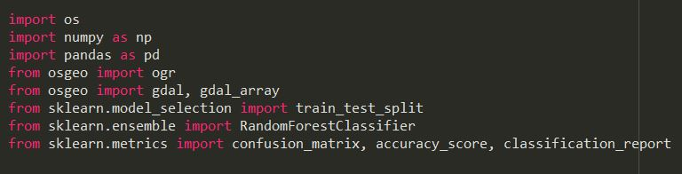
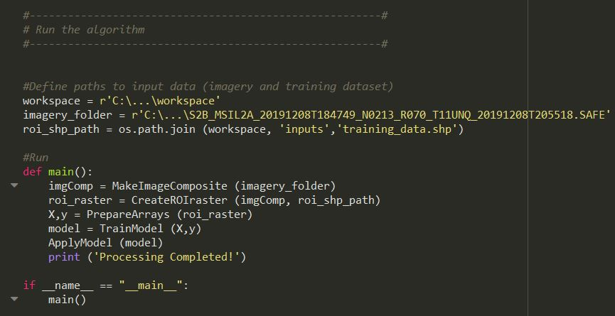

# Sentinel-2 Random Forest Classifier
## Description of the algorithm
## Required packages
The following packages need to be installed on your Python Env to run the this code:
- Numpy
- Pandas
- Osgeo (gdal and ogr)
- Scikit-learn

## User inputs
Running this script requires the folowing user inputs
***1. workspace (folder)***: directory where the script will be executed
***2. Imagery path (folder)***: the SAFE (Standard Archive Format for Europe) directory containing the Sentine-2 imagery. e.g.  S2B_MSIL2A_20191208T184749_N0213_R070_T11UNQ_20191208T205518.SAFE
***3.  Training dataset path (shapefile)***: The Polgyon Shapefile (.shp) containing the training areas. The shp file must have an "Id" field containing unique Class IDs.

